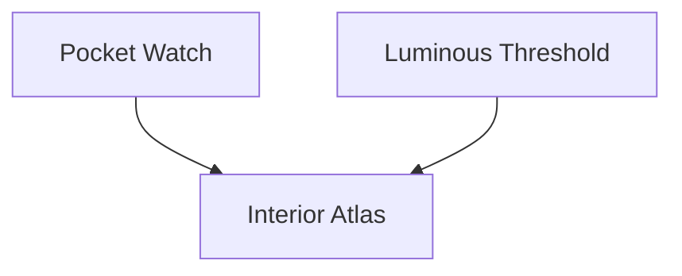
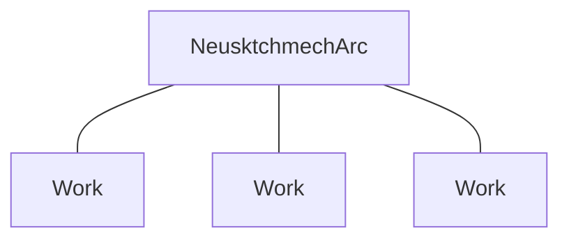
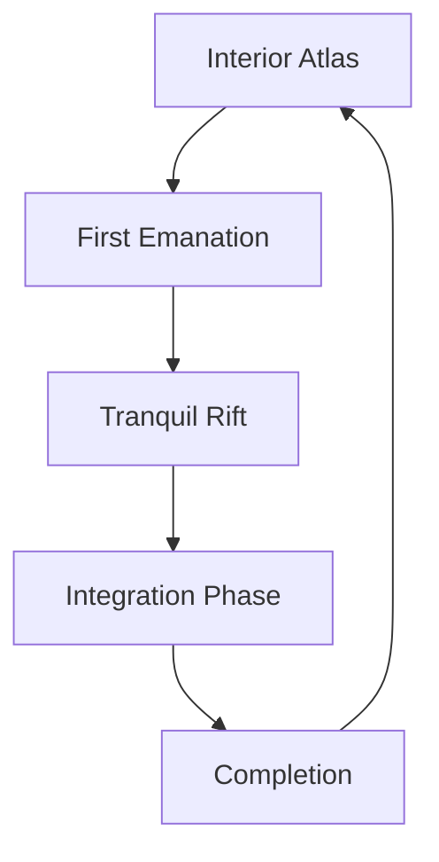
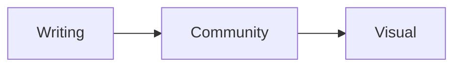

# Diagrams (Visual Companion)

A GitHub-native visual reference mirroring the panels of the [Visual Companion](https://www.neusktchmecharc.site/visual-companion) on the live website. These diagrams are conceptual visualisations of selected relationships within the NeusktchmechArc framework. They represent one possible rendering of the framework and should be understood as conceptual rather than empirical.

---

## 1. Interior Atlas

*A protected conceptual domain representing the source of creative impulses within this framework.*

---

## 2. Constellation of Works

*Multiple works emerge from a shared conceptual reference.*

---

## 3. Four-Phase Progression

**Interior Atlas** — the originating domain of internal impressions.

**First Emanation** — initial outward emergence of an impression.

**Tranquil Rift** — a deliberate pause for settling.

**Integration Phase** — meaning consolidated into form.

**Completion** — a threshold, not a final state.

---

## 4. Origin, Continuity, and Horizon

> **Note on status:** This panel is self-labelled within the original artwork as *"Constellation of works. An interpretive extension of the conceptual archive, not source text."*

*Drawing on the Founder's Note: "the way writing, community experience, and visual exploration appear to intersect within my creative practice."*

**Constellation of Works.** An interpretive extension of the conceptual archive, not source text.

---

**Note:** All diagrams on this page are conceptual illustrations created for the NeusktchmechArc framework. They are intended as symbolic and interpretive representations and are not presented as scientific, psychological, neurological, clinical, or diagnostic models. This page is governed by the [Disclaimer & Legal Context](../DISCLAIMER.md).

---

Return to [README](../README.md) · See also: [The Poem Before the Image](the-poem-before-the-image.md)
