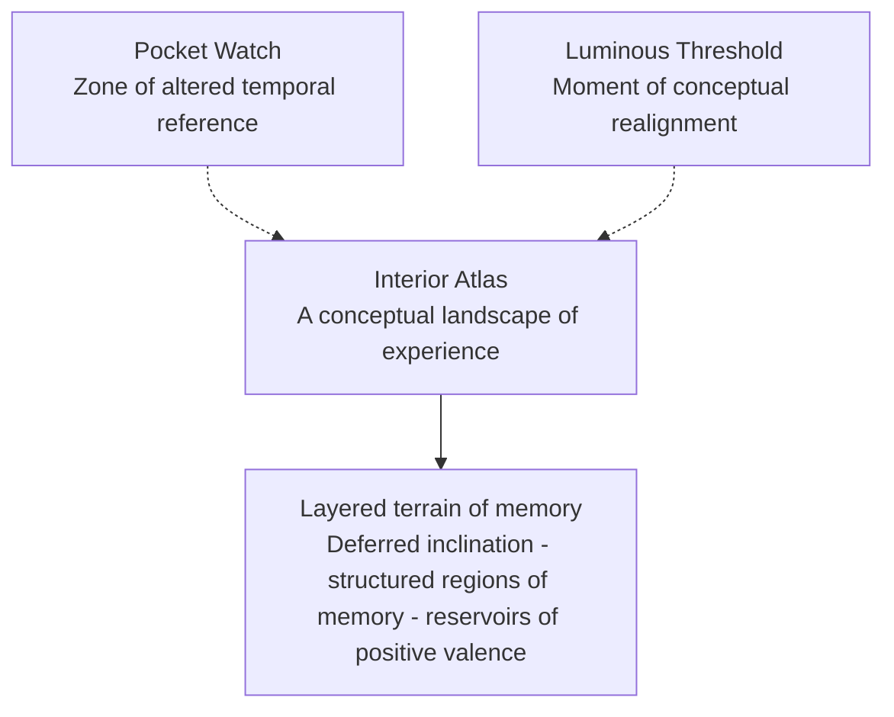
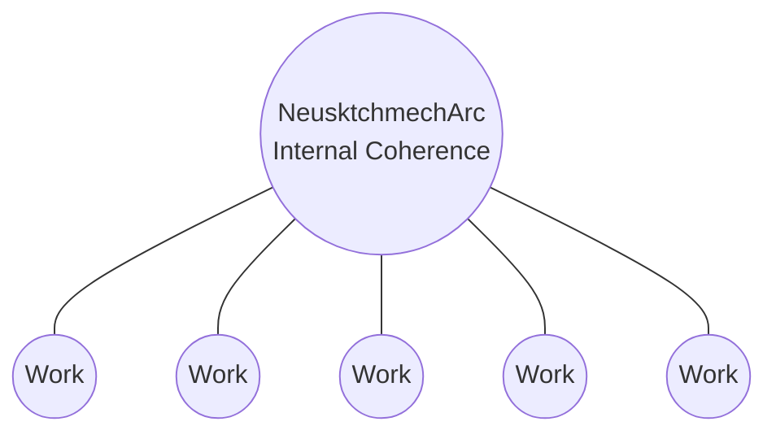
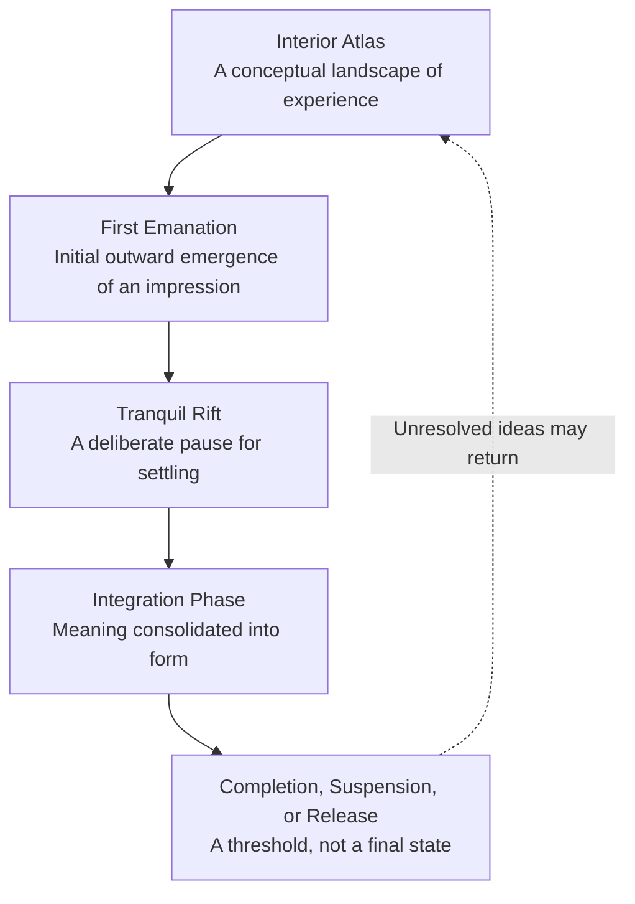

# Diagrams (Visual Companion)

A GitHub-native visual reference mirroring the three panels of the [Visual Companion](https://www.neusktchmecharc.site/visual-companion) on the live website. These diagrams are conceptual visualisations of selected relationships within the NeusktchmechArc framework, intended to support contextual understanding by illustrating symbolic structures, recurring concepts, and internal coherence across the conceptual archive. They represent one possible rendering of the framework and should be understood as conceptual rather than empirical.

## Original Composite (as published on the website)

The Mermaid recreations below are GitHub-native renderings of the same three panels, for readability directly within this repository.

---

## 1. Interior Atlas — A Conceptual Landscape of Experience

*A protected conceptual domain representing the source of creative impulses within this framework.*

---

## 2. Constellation of Works

*Multiple works emerge from a shared conceptual reference. Internal coherence arises from shared internal logic rather than stylistic uniformity.*

---

## 3. Four-Phase Progression

**Interior Atlas** — the originating domain of internal impressions, recollections, and imagined states.

**First Emanation** — the initial outward emergence of an internal impression into provisional form.

**Tranquil Rift** — a deliberate pause allowing the emerging construct to stabilise.

**Integration Phase** — deliberate consolidation of meaning into a resolved, cohesive configuration.

**Completion, Suspension, or Release** — a threshold reached through internal coherence, not exhaustiveness; not all configurations proceed to this threshold, and some are reabsorbed into the Interior Atlas without materialisation (indicated by the dashed return line).

---

**Note:** All diagrams on this page are conceptual illustrations created for the NeusktchmechArc framework. They are intended as symbolic and interpretive representations and are not presented as scientific, psychological, neurological, clinical, or diagnostic models. This page is governed by the [Disclaimer & Legal Context](../DISCLAIMER.md).

---

Return to [README](../README.md) · See also: [The Poem Before the Image](the-poem-before-the-image.md)
